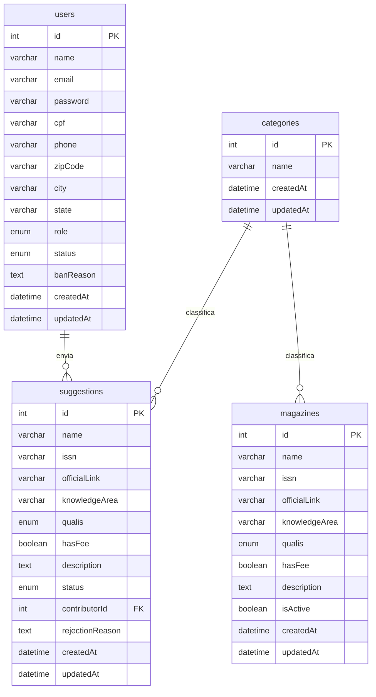

```mermaid
erDiagram
    users {
        int id PK
        varchar name
        varchar email
        varchar password
        varchar cpf
        varchar phone
        varchar zipCode
        varchar city
        varchar state
        enum role
        enum status
        text banReason
        datetime createdAt
        datetime updatedAt
    }

    categories {
        int id PK
        varchar name
        datetime createdAt
        datetime updatedAt
    }

    magazines {
        int id PK
        varchar name
        varchar issn
        varchar officialLink
        varchar knowledgeArea
        enum qualis
        boolean hasFee
        text description
        boolean isActive
        datetime createdAt
        datetime updatedAt
    }

    suggestions {
        int id PK
        varchar name
        varchar issn
        varchar officialLink
        varchar knowledgeArea
        enum qualis
        boolean hasFee
        text description
        enum status
        int contributorId FK
        text rejectionReason
        datetime createdAt
        datetime updatedAt
    }

    users      ||--o{ suggestions : "envia"
    categories ||--o{ magazines : "classifica"
    categories ||--o{ suggestions : "classifica"
```