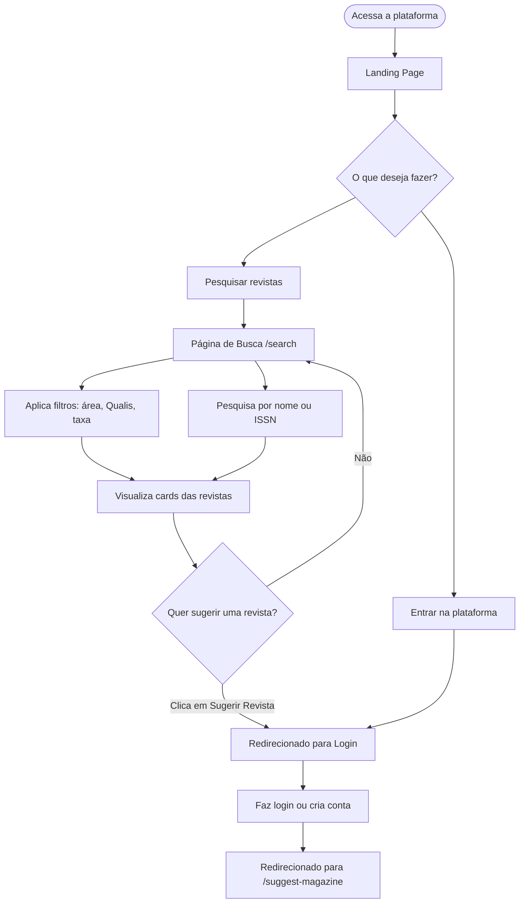
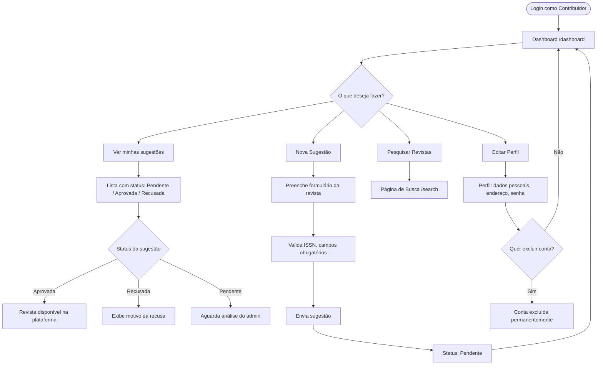
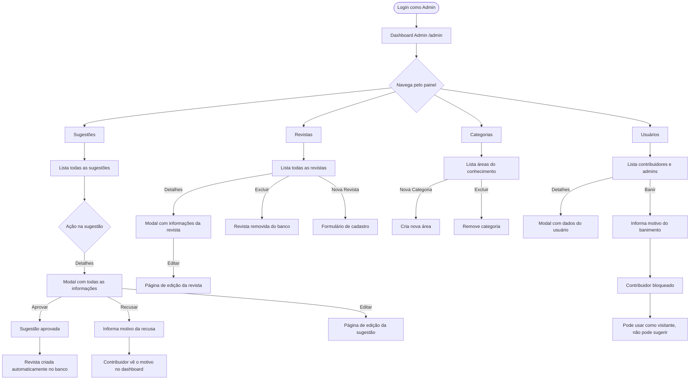
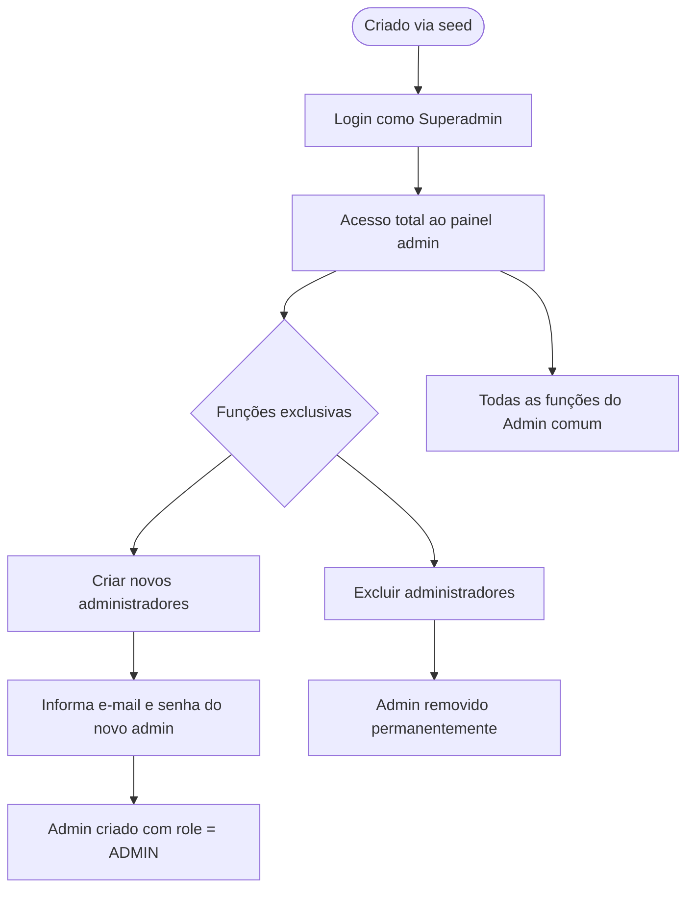

# Fluxo do Utilizador

## Visitante

```mermaid
flowchart TD
    A([Acessa a plataforma]) --> B[Landing Page]
    B --> C{O que deseja fazer?}
    C --> D[Pesquisar revistas]
    C --> E[Entrar na plataforma]
    D --> F[Página de Busca /search]
    F --> G[Aplica filtros: área, Qualis, taxa]
    F --> H[Pesquisa por nome ou ISSN]
    G --> I[Visualiza cards das revistas]
    H --> I
    I --> J{Quer sugerir uma revista?}
    J -->|Clica em Sugerir Revista| K[Redirecionado para Login]
    K --> L[Faz login ou cria conta]
    L --> M[Redirecionado para /suggest-magazine]
    J -->|Não| F
    E --> K
```

## Contribuidor

```mermaid
flowchart TD
    A([Login como Contribuidor]) --> B[Dashboard /dashboard]
    B --> C{O que deseja fazer?}
    C --> D[Ver minhas sugestões]
    C --> E[Nova Sugestão]
    C --> F[Pesquisar Revistas]
    C --> G[Editar Perfil]
    D --> H[Lista com status: Pendente / Aprovada / Recusada]
    H --> I{Status da sugestão}
    I -->|Aprovada| J[Revista disponível na plataforma]
    I -->|Recusada| K[Exibe motivo da recusa]
    I -->|Pendente| L[Aguarda análise do admin]
    E --> M[Preenche formulário da revista]
    M --> N[Valida ISSN, campos obrigatórios]
    N --> O[Envia sugestão]
    O --> P[Status: Pendente]
    P --> B
    F --> Q[Página de Busca /search]
    G --> R[Perfil: dados pessoais, endereço, senha]
    R --> S{Quer excluir conta?}
    S -->|Sim| T[Conta excluída permanentemente]
    S -->|Não| B
```

## Administrador

```mermaid
flowchart TD
    A([Login como Admin]) --> B[Dashboard Admin /admin]
    B --> C{Navega pelo painel}
    C --> D[Sugestões]
    C --> E[Revistas]
    C --> F[Categorias]
    C --> G[Usuários]
    D --> H[Lista todas as sugestões]
    H --> I{Ação na sugestão}
    I -->|Detalhes| J[Modal com todas as informações]
    J -->|Aprovar| K[Sugestão aprovada]
    K --> L[Revista criada automaticamente no banco]
    J -->|Recusar| M[Informa motivo da recusa]
    M --> N[Contribuidor vê o motivo no dashboard]
    J -->|Editar| O[Página de edição da sugestão]
    E --> P[Lista todas as revistas]
    P -->|Detalhes| Q[Modal com informações da revista]
    Q -->|Editar| R[Página de edição da revista]
    P -->|Excluir| S[Revista removida do banco]
    P -->|Nova Revista| T[Formulário de cadastro]
    F --> U[Lista áreas do conhecimento]
    U -->|Nova Categoria| V[Cria nova área]
    U -->|Excluir| W[Remove categoria]
    G --> X[Lista contribuidores e admins]
    X -->|Detalhes| Y[Modal com dados do usuário]
    X -->|Banir| Z[Informa motivo do banimento]
    Z --> AA[Contribuidor bloqueado]
    AA --> AB[Pode usar como visitante, não pode sugerir]
```

## Superadmin (primeiro administrador)

```mermaid
flowchart TD
    A([Criado via seed]) --> B[Login como Superadmin]
    B --> C[Acesso total ao painel admin]
    C --> D{Funções exclusivas}
    D --> E[Criar novos administradores]
    D --> F[Excluir administradores]
    E --> G[Informa e-mail e senha do novo admin]
    G --> H[Admin criado com role = ADMIN]
    F --> I[Admin removido permanentemente]
    C --> J[Todas as funções do Admin comum]
```